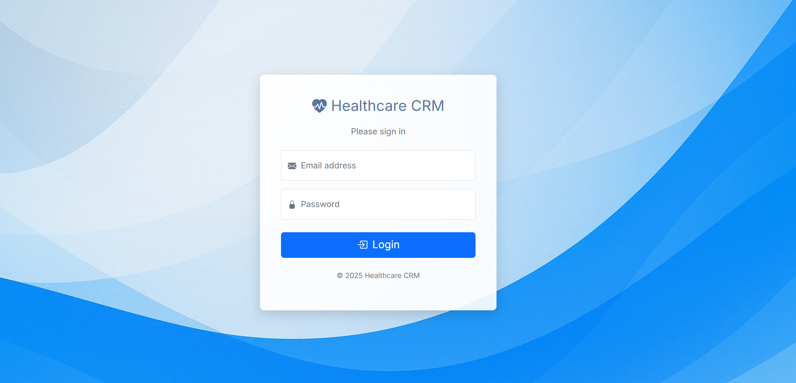

# Healthcare CRM - J2EE Business Components Project

**Project Goal:** A CRM system for healthcare centers to manage customer records, insurance details, and employee task assignments using Spring Boot, Thymeleaf, Spring Security, REST APIs, and Docker deployment.

**Group Members:**

- John Shaize
- Darshan Kiran Upadhyay
- Gaurang Hareshkumar Dhameliya
- Ramees Karolil Rasheed

---

## Technology Stack

- **Backend:** Java 21, Spring Boot 3.4.2, Spring MVC, Spring Data JPA, Spring Security, REST Controllers
- **Frontend:** Thymeleaf, HTML5, CSS3, Bootstrap 5
- **Database:** MySQL 8
- **API Documentation:** Springdoc OpenAPI (Swagger UI)
- **Containerization:** Docker, Docker Compose
- **Build Tool:** Maven
- **ORM:** Hibernate (via Spring Data JPA)
- **Validation:** Jakarta Bean Validation
- **Other:** Lombok

---

## Features Implemented

- **User Roles & Security:** Secure login for Admins and Employees with distinct permissions enforced by Spring Security.
- **Admin Functionality (Web UI):**
  - Dashboard overview (Customer/Employee/Pending Task counts).
  - Full CRUD for Customers (including Insurance).
  - Full CRUD for Employees.
  - Full CRUD for Tasks (assigning to Customer/Employee).
  - Task Follow-Up Center (Overdue/Due Soon tasks).
- **Employee Functionality (Web UI):**
  - View assigned tasks.
  - Update assigned task status.
- **Data Validation:** Server-side validation on forms with user feedback.
- **REST APIs:**
  - CRUD endpoints for Customers, Employees, and Tasks (`/api/**`).
  - Interactive API documentation via Swagger UI.
- **Containerized Deployment:** Application and MySQL database runnable via Docker Compose.
- **Data Initialization:** Automatic creation of default admin user and mock data on first run with an empty database.

---

## Prerequisites

- **Java Development Kit (JDK):** Version 21 or later.
- **Apache Maven:** Version 3.6+ (for building the project JAR).
- **Docker & Docker Compose:** Docker Desktop (recommended) or Docker Engine with Compose plugin/command (supporting `docker compose` or `docker-compose`). Required for containerized deployment.
- **Git:** For cloning the repository.
- **(Optional) Local MySQL Server:** Only required if running the application _without_ Docker (see Local Run Instructions).

---

## Setup and Running Instructions

### Method 1: Using Docker Compose (Recommended)

This method runs the application and a dedicated MySQL database inside containers. It does not require a local MySQL installation.

1.  **Clone the Repository:**
    ```bash
    git clone <your-repository-url>
    cd Health-Care-CRM # Or your project's root directory
    ```
2.  **Navigate to Backend Directory:**
    ```bash
    cd backend
    ```
3.  **Build the Application JAR:**
    ```bash
    # Use -DskipTests if you don't have a local MySQL configured
    # matching application.properties, as tests might run during build.
    mvn clean package -DskipTests
    ```
4.  **(Optional) Build the Docker Image Explicitly:** (Often handled by `up --build`, but good practice)
    ```bash
    # Use ONE of the following commands:
    docker compose build app
    # OR
    # docker-compose build app
    ```
5.  **Start Containers:**
    ```bash
    # Use ONE of the following commands:
    docker compose up
    # OR (to run detached/in background)
    # docker compose up -d
    # OR (if using older docker-compose)
    # docker-compose up
    ```
    _The first time, this will download the MySQL image and build the app image if not done in step 4. It uses the `healthcheck` to wait for the DB before starting the app._
6.  **Access the Application:**
    - Web UI: `http://localhost:8080`
    - API Docs (Swagger UI): `http://localhost:8080/swagger-ui.html`
7.  **Stopping:** Press `Ctrl+C` in the terminal where compose is running, or use `docker compose down` (or `docker-compose down`) if running detached. Add `--volumes` to also remove the database data volume.

### Method 2: Running Locally (Requires Local MySQL)

This method runs the Spring Boot application directly on your machine and connects to a separately running local MySQL server instance.

1.  **Clone the Repository** (if not already done).
2.  **Database Setup:**
    - Ensure your local MySQL server is running.
    - Create a database named `healthcarecrm`.
      ```sql
      CREATE DATABASE healthcarecrm;
      ```
    - Verify/Update database credentials in `backend/src/main/resources/application.properties` to match your local MySQL setup (`spring.datasource.url`, `username`, `password`).
3.  **Navigate to Backend Directory:**
    ```bash
    cd Health-Care-CRM/backend
    ```
4.  **Build the Project:**
    ```bash
    mvn clean package
    ```
    _(This time, tests should pass if the local DB is correctly set up)._
5.  **Run the Application:**
    ```bash
    java -jar target/healthcarecrm-0.0.1-SNAPSHOT.jar
    ```
    _(Alternatively, run using `mvn spring-boot:run` or directly from your IDE)_.
6.  **Access the Application:**
    - Web UI: `http://localhost:8080`
    - API Docs (Swagger UI): `http://localhost:8080/swagger-ui.html`

---

## Default Login Credentials

- The application initializes a default **Admin** user if no admins exist in the database:
  - **Email:** `admin@clinic.com`
  - **Password:** `password123`
- If the database is empty, it also creates mock **Employee** users:
  - **Emails:** `alice.j@clinic.com`, `bob.w@clinic.com`, etc.
  - **Password (for all mock employees):** `password123`

---

## Project Structure

- `backend/`: Contains the Spring Boot application source and build files.
  - `src/main/java`: Main Java source code (Controllers, Services, Repositories, Models, Config).
  - `src/main/resources`: Configuration (`application.properties`), static assets (`static/`), templates (`templates/`).
  - `src/test/java`: Unit tests.
  - `pom.xml`: Maven project configuration.
  - `Dockerfile`: Instructions to build the application's Docker image.
  - `docker-compose.yml`: Defines application and database services for Docker Compose.
- `design-docs/`: Contains design documents and screenshots.
  - `screenshots/`: Contains application screenshots.
  - `phase3-milestone.md`: Final project report document.
- `README.md`: This file.

---

## Screenshots


_Figure 1: Secure login page._


_Figure 2: Admin dashboard overview._


_Figure 3: Customer management interface._


_Figure 4: Task management interface._


_Figure 5: Admin view for overdue/due soon tasks._


_Figure 6: Employee view for managing assigned tasks._


_Figure 7: Form validation feedback._


_Figure 8: Interactive REST API documentation._

---
