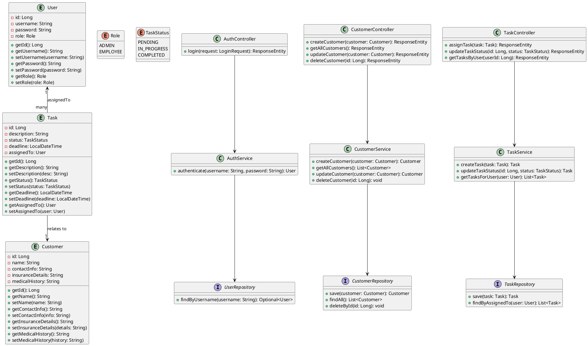

```plantuml
@startuml
' ====================================================
' Domain Entities
' ====================================================

entity User {
  - id: Long
  - username: String
  - password: String
  - role: Role
  + getId(): Long
  + getUsername(): String
  + setUsername(username: String)
  + getPassword(): String
  + setPassword(password: String)
  + getRole(): Role
  + setRole(role: Role)
}

enum Role {
  ADMIN
  EMPLOYEE
}

entity Customer {
  - id: Long
  - name: String
  - contactInfo: String
  - insuranceDetails: String
  - medicalHistory: String
  + getId(): Long
  + getName(): String
  + setName(name: String)
  + getContactInfo(): String
  + setContactInfo(info: String)
  + getInsuranceDetails(): String
  + setInsuranceDetails(details: String)
  + getMedicalHistory(): String
  + setMedicalHistory(history: String)
}

entity Task {
  - id: Long
  - description: String
  - status: TaskStatus
  - deadline: LocalDateTime
  - assignedTo: User
  + getId(): Long
  + getDescription(): String
  + setDescription(desc: String)
  + getStatus(): TaskStatus
  + setStatus(status: TaskStatus)
  + getDeadline(): LocalDateTime
  + setDeadline(deadline: LocalDateTime)
  + getAssignedTo(): User
  + setAssignedTo(user: User)
}

enum TaskStatus {
  PENDING
  IN_PROGRESS
  COMPLETED
}

' Relationships between domain entities
User "1" <-- "many" Task : assignedTo
' (Optional) If you decide to relate Task with Customer:
Task --> "1" Customer : relates to

' ====================================================
' Service Layer
' ====================================================

class AuthService {
  + authenticate(username: String, password: String): User
}

class CustomerService {
  + createCustomer(customer: Customer): Customer
  + getAllCustomers(): List<Customer>
  + updateCustomer(customer: Customer): Customer
  + deleteCustomer(id: Long): void
}

class TaskService {
  + createTask(task: Task): Task
  + updateTaskStatus(id: Long, status: TaskStatus): Task
  + getTasksForUser(user: User): List<Task>
}

' ====================================================
' Repository Interfaces
' ====================================================

interface UserRepository {
  + findByUsername(username: String): Optional<User>
}

interface CustomerRepository {
  + save(customer: Customer): Customer
  + findAll(): List<Customer>
  + deleteById(id: Long): void
}

interface TaskRepository {
  + save(task: Task): Task
  + findByAssignedTo(user: User): List<Task>
}

' ====================================================
' Controller Layer
' ====================================================

class AuthController {
  + login(request: LoginRequest): ResponseEntity
}

class CustomerController {
  + createCustomer(customer: Customer): ResponseEntity
  + getAllCustomers(): ResponseEntity
  + updateCustomer(customer: Customer): ResponseEntity
  + deleteCustomer(id: Long): ResponseEntity
}

class TaskController {
  + assignTask(task: Task): ResponseEntity
  + updateTaskStatus(id: Long, status: TaskStatus): ResponseEntity
  + getTasksByUser(userId: Long): ResponseEntity
}

' ====================================================
' Dependencies (Associations)
' ====================================================

AuthService --> UserRepository
CustomerService --> CustomerRepository
TaskService --> TaskRepository

AuthController --> AuthService
CustomerController --> CustomerService
TaskController --> TaskService

@enduml
```
