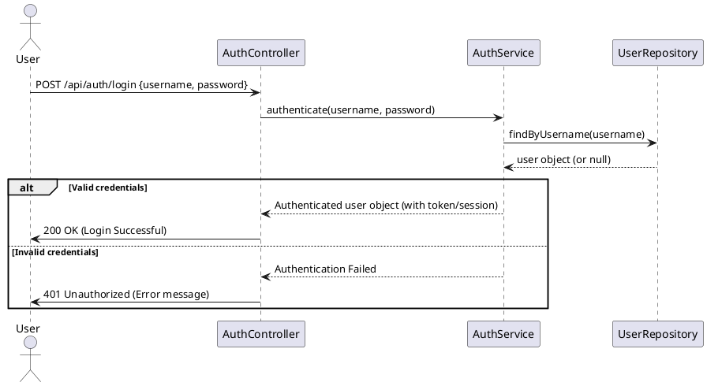
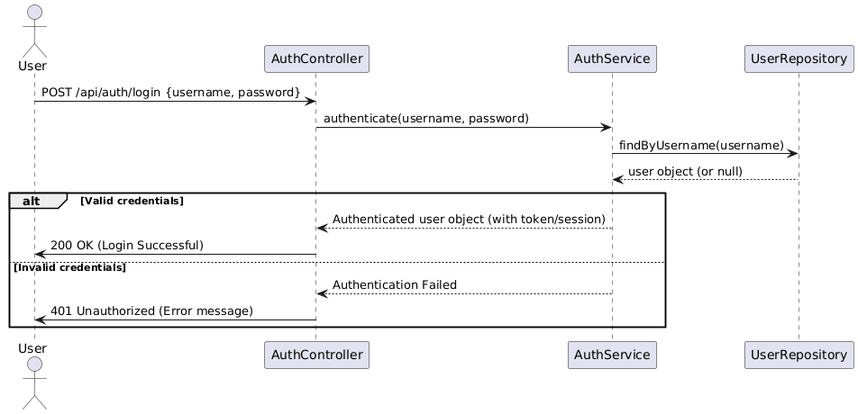
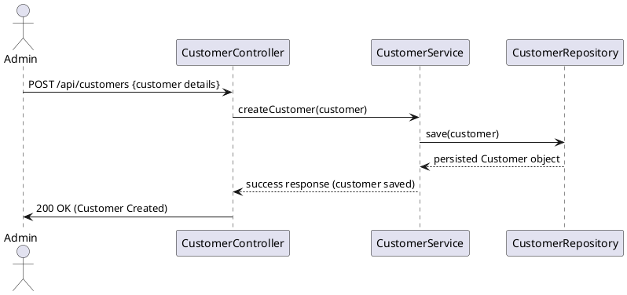
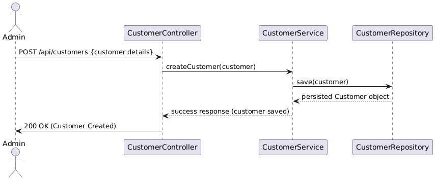
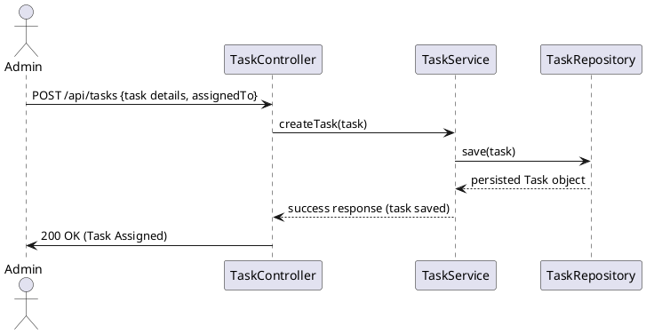
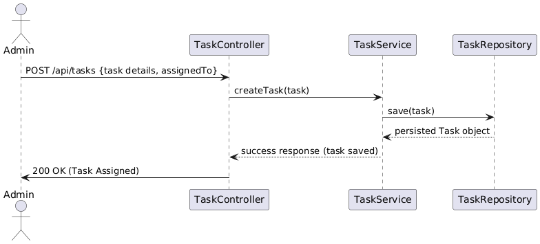
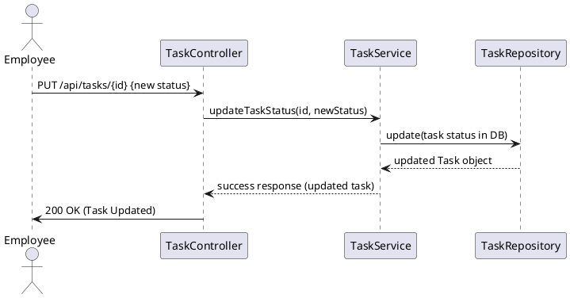
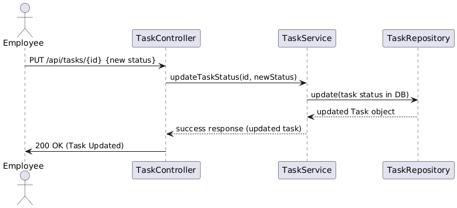

### **Possible User Flows**

1. **User Authentication Flow (Login)**

   - A user (Admin or Employee) submits login credentials.
   - The system validates the credentials via the AuthController, AuthService, and UserRepository.
   - The system returns either a success (with a session/token) or an error response.

2. **Customer Management Flow (Creation, Update, Deletion)**

   - **Customer Creation Flow (Admin):**
     - An Admin submits a new customer's details.
     - The CustomerController passes the details to CustomerService.
     - CustomerService calls CustomerRepository to persist the customer.
     - The system returns a confirmation.
   - **Customer Update & Deletion Flows** follow similar patterns with different endpoints.

3. **Task Management Flow**
   - **Task Assignment Flow (Admin):**
     - An Admin assigns a new task to an employee.
     - The TaskController sends the request to TaskService.
     - TaskService calls TaskRepository to persist the task.
     - A confirmation is returned.
   - **Task Update Flow (Employee):**
     - An Employee updates the status of an assigned task.
     - The TaskController receives the update and delegates it to TaskService.
     - TaskService updates the task status in TaskRepository.
     - The updated task information is returned.
   - **Fetch Tasks Flow (Employee):**
     - An Employee requests a list of their assigned tasks.
     - The TaskController retrieves tasks via TaskService and TaskRepository.

---

### **PlantUML Sequence Diagrams**

#### **1. User Authentication Flow**

## 

#### **2. Customer Creation Flow (Admin)**

## 

#### **3. Task Assignment Flow (Admin assigns a Task)**

## 

---

#### **4. Task Update Flow (Employee updates Task Status)**

## 

---
